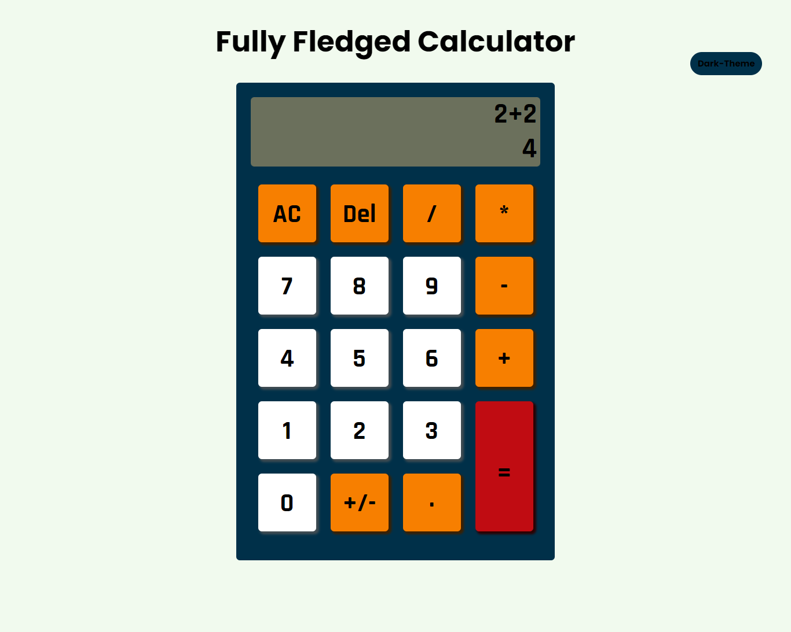
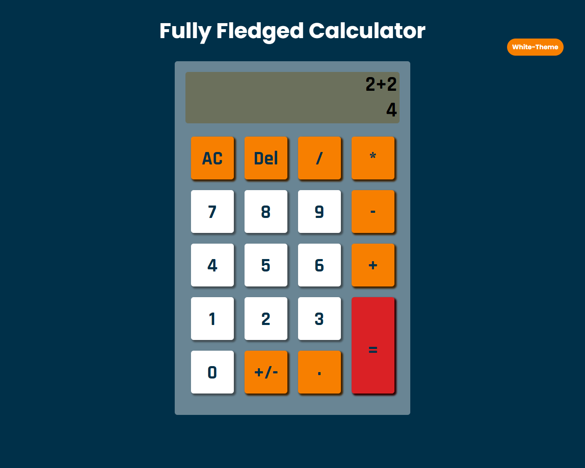

# Fully Fledged Calculator Web Application

This project implements a Fully Fledged Calculator web application with basic arithmetic operations, dark mode toggle, and a user-friendly interface.

## Table of Contents

1. [Introduction](#introduction)
2. [Features](#features)
3. [Technologies Used](#technologies-used)
4. [Usage](#usage)
5. [Installation](#installation)
6. [Screenshots](#screenshots)
7. [Dark Mode Toggle](#dark-mode-toggle)
8. [Contribution](#contribution)

## Introduction

The Fully Fledged Calculator web application is designed to provide users with a simple yet powerful tool for performing arithmetic calculations. The calculator features a modern interface, easy-to-use buttons, and a responsive design. Users can perform addition, subtraction, multiplication, and division operations, and the calculator can handle expressions involving parentheses as well.

## Features

- Basic arithmetic operations: addition, subtraction, multiplication, division.
- Parentheses support for complex expressions.
- Dark mode toggle for enhanced user experience.
- Responsive design for optimal usability on various devices.

## Technologies Used

- HTML: Defines the structure of the calculator interface.
- JavaScript: Implements the calculator's core functionality and dark mode toggle.
- CSS: Styles the calculator interface for an appealing and user-friendly design.
- Google Fonts: Utilized for selecting and applying custom fonts to enhance the visual appeal.
- Font Awesome: Incorporates icons to enhance the user interface.
- favicon.io: used to generate the favicon of our website.

## Usage

To use the calculator:

1. Enter numerical values and use the provided buttons for arithmetic operations.
2. Click the "=" button to calculate the result of the entered expression.
3. Use the "AC" button to clear the calculator's input fields.
4. Use the "Del" button to delete the last character.
5. Click the "+/-" button to negate the current value.
6. Toggle between light and dark modes using the mode toggle button.

## Installation

To run the calculator locally:

1. Clone this repository to your local machine.
2. Open the project folder in a code editor.
3. Open the `index.html` file in a web browser.

## Screenshots

## Dark Mode Toggle

The calculator features a convenient dark mode toggle for enhanced usability in low-light environments. To toggle between light and dark modes, simply click the "Dark-Theme" button.

## Contribution

1. 222002392
2. 222002494
3. 222003153
4. 222003203
5. 222011317
6. 222003612
7. 222003699

Thank You!

Images used in this README are provided in the "images" folder of this repository.
